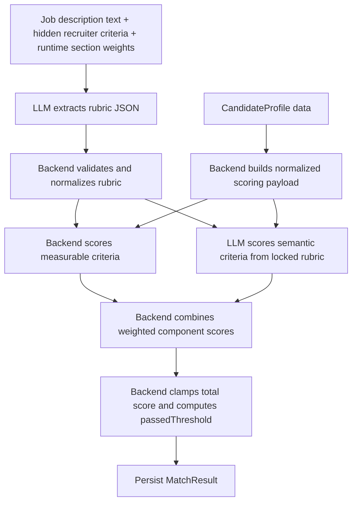

# CV Scoring Architecture After Refactor

## Overview

The scoring pipeline no longer asks the LLM to produce one final score from raw JD and CV data in a single step.

Instead, scoring now follows a locked-rubric architecture:

1. The backend sends the combined JD text to the LLM and asks for a structured scoring rubric JSON.
2. The backend validates and normalizes that rubric.
3. The backend scores measurable criteria directly.
4. The LLM scores only non-measurable semantic criteria using the locked rubric.
5. The backend combines all component scores, clamps the total into `0..100`, and computes pass/fail itself.

This keeps the API shape stable while moving final scoring control back to the backend.

## Current Flow

## Main Files

- [backend/src/services/score_candidate.py](C:/Users/HP/Desktop/Recruitment_AI_assistant/backend/src/services/score_candidate.py)
  Implements rubric extraction, rubric normalization, measurable scoring, semantic-score parsing, final score combination, and persistence.
- [backend/src/prompts/build_prompts.py](C:/Users/HP/Desktop/Recruitment_AI_assistant/backend/src/prompts/build_prompts.py)
  Builds the rubric extraction prompt, locked semantic scoring prompt, and the fallback legacy batch scoring prompt.
- [backend/tests/test_score_candidate_service.py](C:/Users/HP/Desktop/Recruitment_AI_assistant/backend/tests/test_score_candidate_service.py)
  Covers rubric normalization and scoring edge cases.
- [backend/tests/test_build_prompts.py](C:/Users/HP/Desktop/Recruitment_AI_assistant/backend/tests/test_build_prompts.py)
  Verifies scoring prompts include the expected sections and rubric instructions.

## Data Inputs

### Job description input

The scoring service combines:

- `JobDescription.jd_text`
- `JobDescription.hidden_text`
- runtime `section_weights`

The helper `_build_scoring_job_description_text()` makes hidden recruiter criteria part of the scoring context without changing the public API.

### Candidate input

The candidate payload now includes all supported scoring sections:

- `experience_years`
- `skills`
- `experience`
- `education`
- `projects`
- `summary`
- `languages`
- `achievements`
- `certifications`
- `publications`
- `other`

This fixes the earlier mismatch where some UI-selectable weights existed but their section content was not actually sent to the LLM.

## Rubric Model

The extracted rubric is normalized into a runtime structure with:

- `criteria`
- `sectionWeights`

Each criterion contains:

- `key`
- `section`
- `requirementText`
- `type`
- `measurable`
- `weight`

### Supported sections

Only these sections are accepted:

- `skills`
- `experience`
- `education`
- `projects`
- `summary`
- `languages`
- `achievements`
- `certifications`
- `publications`
- `other`

Invalid sections are dropped during normalization.

### Supported criterion types

- `must_have`
- `semantic`
- `upper_bound`

If the LLM returns an unknown type, the backend coerces it to `semantic`.

## Weight Normalization Rules

The backend does not blindly trust the UI or the LLM for section usage.

Normalization rules:

- Only sections that actually appear in the normalized rubric remain active.
- If the JD does not mention a section, that section does not contribute positively or negatively.
- Runtime `section_weights` are re-normalized across active rubric sections only.
- Criterion-level weights are derived by splitting a section's normalized weight evenly across that section's criteria.

This prevents unused sections such as `education` from affecting the final score when the JD never references them.

## Measurable Criteria

Measurable criteria are scored fully by the backend.

Current measurable handling includes:

- numeric comparisons like `experience_years >= 5`
- string containment checks such as language text containing `English`
- extracted numeric checks from language certifications such as `IELTS`, `TOEIC`, and `TOEFL`

The backend evaluates measurable criteria using:

- `_extract_candidate_field()`
- `_compare_measurable()`
- `_score_measurable_criterion()`

For measurable criteria:

- passing the rule yields score `100`
- failing the rule yields score `0`

This means `5 years` and `10 years` are equal on a `>= 5` must-have rule unless another semantic criterion separately rewards seniority or depth.

## Upper Bound Criteria

`upper_bound` is used for capped bonus-style requirements such as:

- `IELTS 7.5+ is a plus`

The design intent is:

- it does not add arbitrary bonus points on top of a section
- it unlocks the maximum attainable score for that criterion path

In the current runtime model, this is represented as an independent criterion with its own normalized weight. The backend still controls its exact contribution through the normalized rubric weights rather than allowing free-form LLM bonus inflation.

## Semantic Criteria

Non-measurable criteria are sent to the LLM only after the rubric is locked by the backend.

The semantic scoring prompt:

- includes the locked rubric
- includes the candidate section data
- instructs the LLM to score only the listed criteria
- requires evidence for each criterion

The LLM returns per-candidate semantic rows, which the backend maps by `candidateId` and `criterionKey`.

## Final Score Assembly

The backend computes:

- `weightedScore = weight * score`
- `totalScore = sum(componentScores[*].weightedScore)`
- `passedThreshold = totalScore >= score_threshold`

The backend clamps `totalScore` into `0..100`.

The backend never trusts `passedThreshold` from the LLM. Even in fallback mode, `_coerce_passed_threshold()` recomputes it from the backend threshold.

## Fallback Path

If rubric extraction fails because the LLM returns invalid JSON or produces an empty/invalid rubric:

1. the scoring run still continues
2. the service falls back to the prior batch scoring prompt style
3. the fallback prompt now still includes the richer candidate section payload
4. the backend still recomputes `passedThreshold`

This keeps scoring available without requiring rubric extraction to succeed every time.

## Persistence

The service still persists the existing entities:

- `MatchRun`
- `MatchResult`

No schema change is required for this refactor.

`component_scores` remains the main place to audit how a score was built. Criterion keys may now be more granular, for example:

- `experience_years`
- `languages.english_communication`
- `languages.ielts_7_5_upper_bound`

## Behavioral Guarantees

The refactor is intended to preserve these rules:

- the `/score/` and `/jobs/{job_id}/score` API contracts stay unchanged
- unsupported rubric sections are ignored
- empty requirements are ignored
- a missing JD section cannot drag the score down
- threshold rules behave as pass/fail, not linear bonus ramps
- backend pass/fail authority overrides the LLM

## Known Limitations

- Criterion weights are currently split evenly within a section rather than using a richer per-criterion importance model.
- `upper_bound` is implemented through normalized criterion weights, not a separate section-cap engine.
- The measurable parser assumes structured fields already exist in `CandidateProfile`; it does not parse raw JD text itself.
- Full scoring audit storage still lives inside existing result fields rather than a dedicated rubric persistence table.

## Recommended Next Steps

- Persist the normalized rubric snapshot alongside each scoring run for stronger auditability.
- Expand measurable extraction beyond language scores and experience thresholds.
- Add end-to-end service tests that mock sequential LLM calls for rubric extraction and semantic scoring.
- Consider a dedicated per-section cap model if `upper_bound` rules become more complex.
